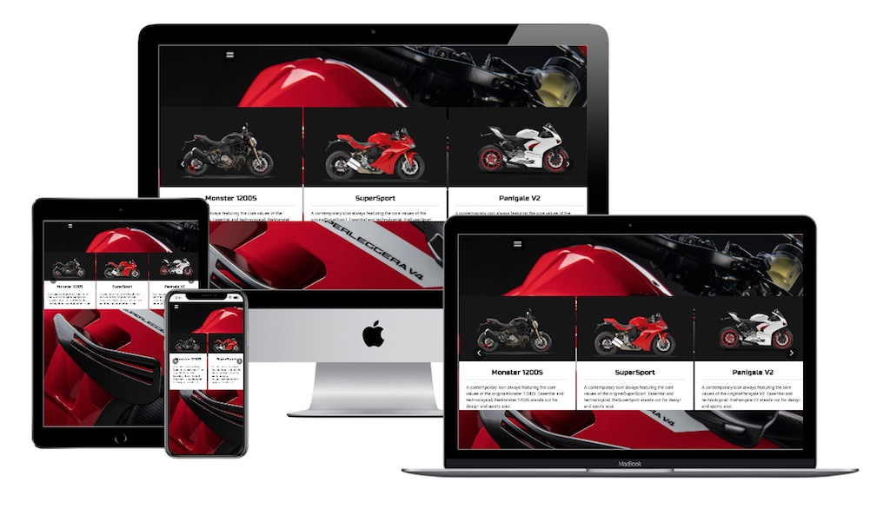
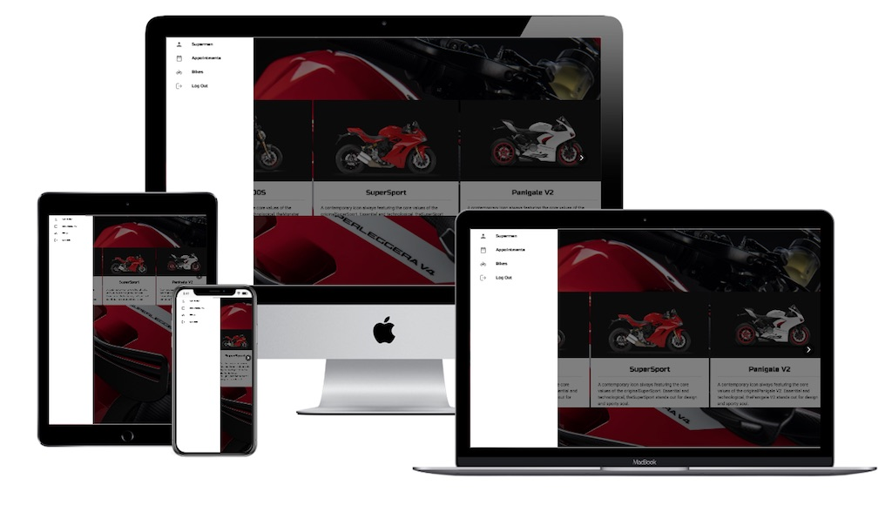
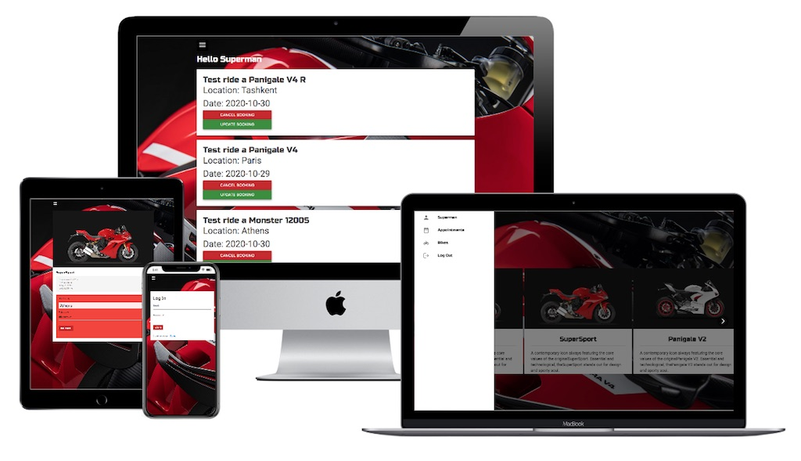

# BookADuc App

This is the final Microverse's capstone project. The purpose of the project is to create a Full-Stack app that works with a back-end written in Rails and a front-end in React. This repo contains the front-end part of the project. It's a React app that works as an interface to handle connections to the backend API. This is the link to the backend [bookaduc-api](https://github.com/macnick/bookaduc-api/tree/authentication).

The App can

1. Create and authenticate users
2. Get a list of available bikes to ride
3. Book an appointment for a ride
4. See the list of the user's appointments
5. Navigate using the sidebar
6. It is optimized for tablets but it is responsive and looks nice everywhere

## Table of Contents

- [Technologies Used](#Technologies-Used)
- [Live Version](#Live-version)
- [Video](#Video)
- [Screenshots](#Screenshots)
- [Install and Run](#How-to-Install-and-Run-in-Your-Computer)
- [Acknowledgements](#Acknowledgements)
- [Author](#Author)
- [Contributing](#Contributing)
- [Show your support](#Show-your-support)

## Technologies Used

- Node.js
- React
- React-DOM
- React-Create-App
- React-Router-Dom
- React-Hook-Form
- Redux
- npm
- HTML/CSS
- Materializecss
- ES6
- ESlint
- Netlify

[Up](#Table-of-Contents)

## Live version

A live version is hosted on Netlify.

- [**BookADuc**](https://bookaduc.netlify.app) @ Netlify

[Up](#Table-of-Contents)

## Screenshots

[Up](#Table-of-Contents)

## How to Install and Run in Your Computer

To run the scripts **npm** is required. To get npm you have to install [Node.js](https://nodejs.org). Follow the installation instructions for your system Mac, Linux or Windows.

Use your terminal and run the commands after each instruction.

| Command | Description |
| ------- | ----------- |
| `git clone https://github.com/macnick/bookaduc-client.git` | Clone the repository to you computer|
| `cd bookaduc-client` | Navigate to the newly created folder   |
| `npm install` |   Install dependencies on your directory |
| `npm start` | Run the app and start the development server |
|  | Press `Ctrl + c` to kill http-server process |
| `http://localhost:3000` | Visit this link to use the App |

[Up](#Table-of-Contents)

## Acknowledgements

- [Microverse](https://www.microverse.org) software development school

[Up](#Table-of-Contents)

## 👤 Author

## Nick Haralampopoulos

- Github: [@macnick](https://github.com/macnick)
- Twitter: [@mac_experts](https://twitter.com/mac_experts)
- Linkedin: [Nick Haralampopoulos](https://www.linkedin.com/in/nick-haralampopoulos/)
- AngelList: [Nick Haralampopoulos](https://angel.co/u/nick-haralampopoulos)

## 🤝 Contributing

Contributions, issues and feature requests are welcome!

Feel free to check the [issues page](https://github.com/macnick/bookaduc-client/issues).

1. Fork it (https://github.com/macnick/bookaduc-client/fork)
2. Create your feature branch (git checkout -b your-new-feature)
3. Commit your changes (git commit -am 'Add some feature')
4. Push to the branch (git push origin my-new-feature)
5. Create a new Pull Request

## Show your support

Give a ⭐️ if you enjoyed this project!

## 📝 License

This project is [MIT](lic.url) licensed.
